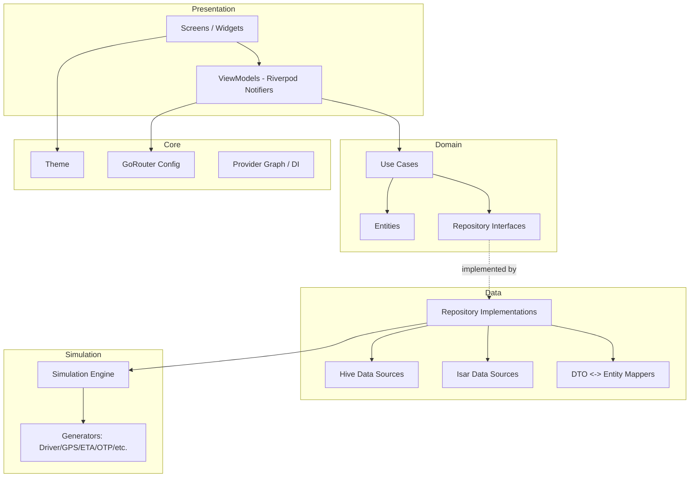
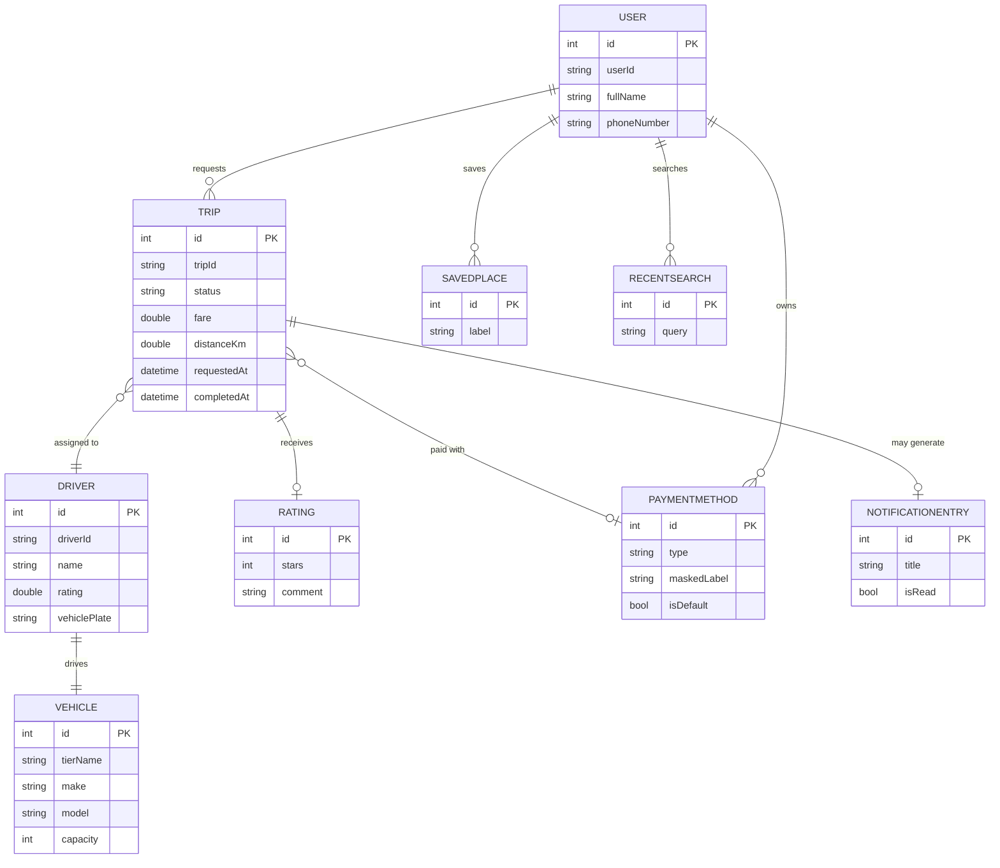
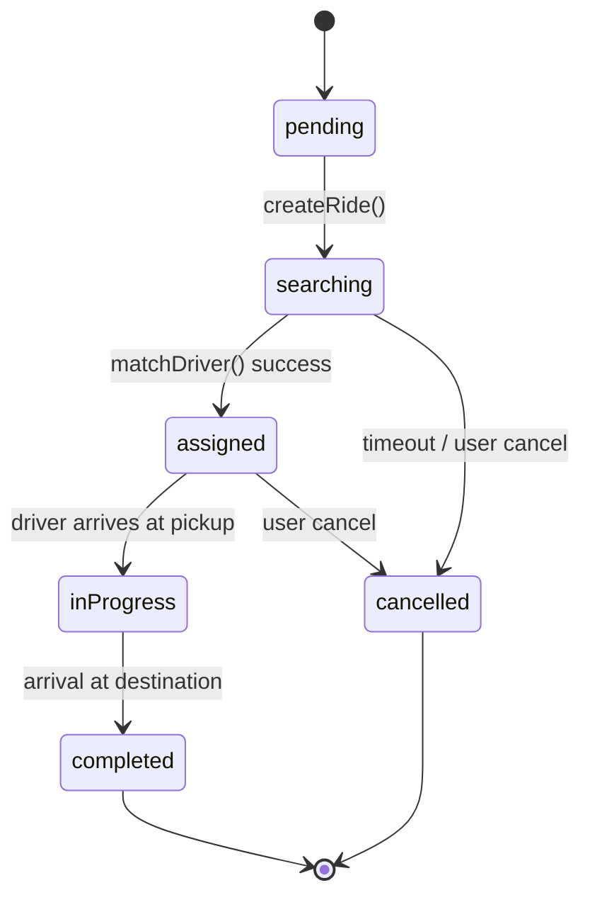

# RideFlow Simulator — Software Architecture Document

**Version:** 1.0
**Type:** Fully offline ride-booking simulator (no backend, no real APIs, no real payments)
**Audience:** Senior Flutter development team

---

## Table of Contents

1. [Objectives](#1-objectives)
2. [Technology Stack Decisions](#2-technology-stack-decisions)
3. [Architecture Overview](#3-architecture-overview)
4. [Complete Folder Structure](#4-complete-folder-structure)
5. [Feature Modules](#5-feature-modules)
6. [State Management](#6-state-management)
7. [Local Database Design](#7-local-database-design)
8. [Data Models](#8-data-models)
9. [Simulation Engine](#9-simulation-engine)
10. [Mock Services](#10-mock-services)
11. [Repository Layer](#11-repository-layer)
12. [Performance Strategy](#12-performance-strategy)
13. [Security Strategy](#13-security-strategy)
14. [Testing Strategy](#14-testing-strategy)
15. [Deployment](#15-deployment)
16. [Future Backend Migration](#16-future-backend-migration)

---

## 1. Objectives

RideFlow Simulator must be built as if it were a real production ride-booking app minus the network — clean layering, deterministic simulated data flows, and an architecture that lets a future team swap in a real backend without touching the UI layer. Every design decision below optimizes for: **clean separation of concerns, scalability of feature count, modularity for team parallelization, offline-first data access, high testability, long-term maintainability, and 60fps performance.**

---

## 2. Technology Stack Decisions

### 2.1 Frontend
**Flutter (latest stable) + Dart** — the only reasonable choice given the explicit Android/Flutter requirement; strong widget performance, hot reload for iteration speed, and a mature ecosystem for local persistence and animation.

### 2.2 State Management

| Option | Pros | Cons |
|---|---|---|
| Provider | Simple, low boilerplate, official Flutter-team support | Weaker for complex async chains, less structure at scale |
| Bloc | Extremely structured, great testability, strict event/state contract | Verbose boilerplate, steeper learning curve for a solo/small team |
| GetX | Very low boilerplate, built-in DI/routing | Poor separation of concerns, "magic" globals hurt testability, community trust has declined |
| **Riverpod** ✅ | Compile-safe (no `BuildContext` needed), first-class async support (`AsyncNotifier`/`FutureProvider`), excellent testability (fully mockable providers, no widget tree needed for tests), scoped caching/auto-dispose | Slightly more upfront learning than Provider |

**Decision: Riverpod (with code generation via `riverpod_generator`).**
Rationale: the simulation engine emits a constant stream of async, time-based state changes (driver search countdowns, live GPS ticks, ETA updates). Riverpod's `AsyncNotifier`/`StreamProvider` model maps directly onto this without manual `ChangeNotifier` plumbing, its `autoDispose` behavior naturally tears down simulation timers when a screen is popped (critical for battery/memory on a mobile device), and it is trivially unit-testable via `ProviderContainer` without pumping a widget tree — a major win given the Testing Strategy goals in §14.

### 2.3 Navigation

| Option | Pros | Cons |
|---|---|---|
| Navigator 2.0 (raw) | Full control | Very high boilerplate, painful for a 25-screen app |
| AutoRoute | Type-safe, code-gen routes, good nested-nav support | Extra build-runner dependency, slightly heavier setup |
| **GoRouter** ✅ | Official Flutter/Google package, declarative, first-class deep-link support, simple nested/shell routes (perfect for bottom-nav + map-overlay sheets), URL-based routing maps cleanly to the `rideflow://` deep links in the design spec | Less compile-time safety than AutoRoute (mitigated with route name constants) |

**Decision: GoRouter.**
Rationale: it is the officially maintained solution, integrates cleanly with Riverpod via `riverpod` + `go_router` community glue, supports the `ShellRoute` pattern needed for the persistent bottom-navigation + floating-map layout, and natively supports the deep link scheme (`rideflow://ride/{id}`) specified in the design document.

### 2.4 Local Database

| Criterion | Hive | SQLite (sqflite/drift) | **Isar** ✅ |
|---|---|---|---|
| Read speed | Very fast (key-value) | Moderate (SQL parsing overhead) | Fastest (native binary, zero-copy reads) |
| Write speed | Fast | Moderate | Fast, with async/isolate-safe batched writes |
| Offline capability | Full | Full | Full |
| Scalability (complex queries) | Poor — no real querying, only key lookups | Excellent — full SQL, joins, indexes | Excellent — rich query builder, compound indexes, full-text search |
| Complexity | Low | High (schema migrations, raw SQL or ORM boilerplate) | Low–Medium (schema via code-gen, type-safe queries) |
| Memory usage | Low | Low–Moderate | Low, memory-mapped |
| Relationships | Manual (no native relations) | Native (foreign keys) | Native (`IsarLink`/`IsarLinks`) |

**Decision: Isar.**
Rationale: RideFlow's data model has real relationships (a `Trip` links to a `Driver`, a `Vehicle`, multiple `Location` points, and a `Rating`) and needs sortable/filterable queries (ride history by date, filtered statistics) — Hive can't do this natively and SQLite requires heavier boilerplate for the same type-safety Isar gives out of the box via code generation. Isar also ships a Flutter Inspector for debugging, has excellent cold-start performance (important for the <2s cold start target in §12), and stores data as native Dart objects with zero (de)serialization overhead on read.

### 2.5 Settings Storage
**Recommendation: Hive (not SharedPreferences)**, used specifically for the small, flat `Settings` box (theme mode, notification toggles, unit preferences).
Rationale: `SharedPreferences` is fine for a handful of primitives, but Hive gives us a single consistent local-storage paradigm across the app (avoiding a second dependency), supports typed objects out of the box (no manual string/bool juggling), and is fast enough for settings reads on every app launch. We deliberately do **not** use Isar for settings — Isar's query engine is overkill for a single flat key-value settings object, and keeping Isar reserved for relational domain data (rides, drivers, history) keeps the two storage layers conceptually distinct: **Isar = domain data, Hive = app preferences.**

### 2.6 Maps

| Criterion | Google Maps (`google_maps_flutter`) | **OpenStreetMap / `flutter_map`** ✅ |
|---|---|---|
| Licensing | Commercial, requires API key + billing account | Open, OSM attribution required, no API key needed |
| Offline capability | Limited (requires Google's paid offline tile caching) | Full — `flutter_map` supports fully local/bundled vector or raster tiles |
| Pricing | Pay-per-load beyond free tier — inappropriate for a simulator with no revenue | Free |
| Performance | Excellent native rendering | Very good, especially with vector tiles; slightly more manual optimization needed |
| Implementation complexity | Low (mature plugin) but requires Google Cloud project setup, billing, API key management | Low–Medium; requires bundling/caching a tile source but no external account needed |

**Decision: `flutter_map` (OpenStreetMap-compatible).**
Rationale: since this is a fully offline simulator with **no real backend and no billing relationship**, requiring a Google Cloud API key and billing account for a demo/simulator app is both unnecessary overhead and against the spirit of the "fully offline" requirement. `flutter_map` lets us bundle a small offline tile set (or use a locally cached tile provider) for a constrained demo region, fully supports custom markers/polylines/camera animation as required in the Map Design spec (§12 of `design.md`), and has zero external dependency risk.

---

## 3. Architecture Overview

### 3.1 Guiding Patterns
- **Clean Architecture** — strict dependency rule: `presentation → domain ← data`. Domain never imports from data or presentation.
- **MVVM** within Presentation — each screen has a `View` (widget) + `ViewModel` (Riverpod `Notifier`/`AsyncNotifier`) that exposes immutable UI state.
- **Repository Pattern** — domain-facing repositories abstract over data sources (Isar/Hive/Simulation Engine), so ViewModels never talk to storage directly.
- **Dependency Injection** — via Riverpod `Provider`s themselves (no separate DI framework needed — Riverpod's provider graph *is* the DI container).
- **Feature-First structure** — each feature owns its full vertical slice (presentation/domain/data) rather than grouping horizontally by layer across the whole app.

### 3.2 Layer Responsibilities

| Layer | Responsibility | Contains |
|---|---|---|
| **Presentation** | Renders UI, captures user input, holds ephemeral UI state | Screens, widgets, ViewModels (Notifiers), route definitions |
| **Domain** | Pure business logic, framework-agnostic | Entities, use cases (interactors), repository interfaces |
| **Data** | Implements domain repository interfaces | Repository implementations, data sources (Isar collections, Hive boxes), DTOs + mappers |
| **Core** | Cross-cutting app infrastructure | Theme, routing config, constants, extensions, DI wiring, error types |
| **Shared** | Reusable UI/logic used across ≥2 features | Shared widgets, shared providers, formatters |
| **Simulation** | The "fake backend" — generates realistic time-based data | Generators, engines, randomization utilities |
| **Infrastructure** | Concrete platform-facing services | Local notification scheduling, permission handling, device info |

### 3.3 High-Level Architecture Diagram



### 3.4 Dependency Rule
`Presentation` depends on `Domain`. `Data` depends on `Domain` (implements its interfaces). `Domain` depends on **nothing** else in the app. `Simulation` is treated as an alternate/primary "data source" that `Data`-layer repositories consume — meaning when a real backend arrives later, only the `Data` layer's data-source implementations change (see §16).

---

## 4. Complete Folder Structure

```
lib/
├── main.dart
├── bootstrap.dart                     # App init: Isar/Hive open, provider overrides, error handlers
│
├── core/
│   ├── config/
│   │   ├── app_config.dart            # Env flags, feature toggles, simulation speed multipliers
│   │   └── flavor_config.dart         # dev/staging/prod flavor definitions
│   ├── theme/
│   │   ├── app_colors.dart            # Tokens from design.md §2/§17
│   │   ├── app_typography.dart        # Tokens from design.md §3
│   │   ├── app_spacing.dart
│   │   ├── app_theme.dart             # ThemeData light/dark
│   │   └── ride_flow_tokens.dart      # ThemeExtension (design.md §18.9)
│   ├── routing/
│   │   ├── app_router.dart            # GoRouter config + ShellRoute
│   │   ├── route_paths.dart           # Route name/path constants
│   │   └── deep_link_handler.dart
│   ├── constants/
│   │   ├── app_constants.dart
│   │   ├── db_constants.dart          # Box/collection names, schema versions
│   │   └── simulation_constants.dart  # Default ETAs, fare ranges, timer intervals
│   ├── utils/
│   │   ├── formatters.dart            # Currency, date, distance formatting
│   │   ├── validators.dart
│   │   ├── geo_utils.dart             # Haversine distance, bearing calc
│   │   └── logger.dart
│   ├── extensions/
│   │   ├── context_extensions.dart
│   │   ├── string_extensions.dart
│   │   └── datetime_extensions.dart
│   ├── error/
│   │   ├── failures.dart              # Sealed Failure types (domain-safe errors)
│   │   └── exceptions.dart            # Data-layer exceptions
│   └── di/
│       └── provider_overrides.dart    # Testing/DI override helpers
│
├── infrastructure/
│   ├── services/
│   │   ├── permission_service.dart    # Location/notification permission handling
│   │   ├── notification_service.dart  # flutter_local_notifications wrapper
│   │   ├── haptics_service.dart
│   │   └── device_info_service.dart
│   └── storage/
│       ├── isar_provider.dart         # Isar instance singleton provider
│       └── hive_provider.dart         # Hive box singleton providers
│
├── simulation/
│   ├── engine/
│   │   ├── simulation_engine.dart     # Central orchestrator (see §9)
│   │   └── simulation_clock.dart      # Testable virtual clock abstraction
│   ├── generators/
│   │   ├── driver_generator.dart
│   │   ├── vehicle_generator.dart
│   │   ├── ride_generator.dart
│   │   ├── eta_generator.dart
│   │   ├── gps_movement_generator.dart
│   │   ├── otp_generator.dart
│   │   ├── notification_generator.dart
│   │   ├── payment_simulator.dart
│   │   ├── rating_generator.dart
│   │   ├── trip_duration_generator.dart
│   │   └── failure_scenario_generator.dart
│   ├── data/
│   │   ├── driver_name_pool.dart
│   │   ├── vehicle_catalog.dart
│   │   └── city_bounds.dart           # Simulated city bounding box(es) for GPS gen
│   └── config/
│       └── simulation_config.dart     # Randomization seeds, probability weights
│
├── shared/
│   ├── widgets/
│   │   ├── buttons/                   # AppButton + variants (design.md §8)
│   │   ├── inputs/                    # AppInput + variants (design.md §9)
│   │   ├── cards/                     # VehicleCard, DriverCard, etc. (design.md §10)
│   │   ├── sheets/                    # RideFlowBottomSheet wrapper (design.md §11)
│   │   ├── map/                       # RideFlowMap, marker widgets (design.md §12)
│   │   ├── loaders/                   # Shimmer skeletons, spinners
│   │   └── feedback/                  # Snackbars, dialogs, empty states
│   ├── providers/
│   │   ├── connectivity_state_provider.dart  # Simulated "online/offline" flag if needed
│   │   └── theme_mode_provider.dart
│   └── mixins/
│       └── auto_dispose_timer_mixin.dart
│
├── features/
│   ├── authentication/
│   │   ├── presentation/
│   │   │   ├── screens/               # login_screen.dart, otp_screen.dart, profile_setup_screen.dart
│   │   │   ├── viewmodels/            # login_viewmodel.dart (AsyncNotifier)
│   │   │   └── widgets/
│   │   ├── domain/
│   │   │   ├── entities/              # user.dart
│   │   │   ├── repositories/          # auth_repository.dart (interface)
│   │   │   └── usecases/              # send_otp_usecase.dart, verify_otp_usecase.dart
│   │   └── data/
│   │       ├── repositories/          # auth_repository_impl.dart
│   │       ├── datasources/           # auth_local_datasource.dart, fake_auth_service.dart
│   │       └── models/                # user_model.dart (Isar collection + mapper)
│   │
│   ├── home/
│   ├── maps/
│   ├── vehicle_selection/
│   ├── ride_booking/
│   ├── driver_simulation/
│   ├── ride_tracking/
│   ├── ride_completion/
│   ├── payments/
│   ├── ratings/
│   ├── history/
│   ├── notifications/
│   ├── profile/
│   ├── settings/
│   └── statistics/
│       └── (each mirrors the presentation/domain/data structure shown for authentication)
│
└── assets/
    ├── icons/
    ├── illustrations/
    ├── vehicles/                      # SVGs per design.md §19.3
    ├── fonts/                         # Inter family weights
    └── map_tiles/                     # Bundled/offline tile cache (if applicable)
```

**Folder purpose summary:**
- `core/` — infrastructure-agnostic app plumbing shared by everything (theme, routing, constants). No feature-specific logic ever lives here.
- `infrastructure/` — thin wrappers around platform/plugin APIs (permissions, notifications, storage engines) that features consume via DI, never directly.
- `simulation/` — the entire "fake backend." This is the single folder that would be deleted/replaced during a real backend migration (see §16).
- `shared/` — cross-feature reusable UI and state; a widget graduates here only once used by ≥2 features.
- `features/` — one folder per vertical slice, each internally following Clean Architecture's presentation/domain/data split.
- `assets/` — static resources, organized to mirror design.md's asset categories.

---

## 5. Feature Modules

For each module: **Responsibilities · Dependencies · Repositories · Providers · Database · Navigation · Widgets**

### 5.1 Authentication
- **Responsibilities:** Simulated phone-based login, OTP verification, first-time profile setup.
- **Dependencies:** `simulation/generators/otp_generator.dart`, `infrastructure/storage` (Hive session flag).
- **Repositories:** `AuthRepository` → `AuthRepositoryImpl` (wraps `FakeAuthService`).
- **Providers:** `authViewModelProvider` (`AsyncNotifier<AuthState>`), `currentUserProvider`.
- **Database:** `User` Isar collection (single row acts as "current user").
- **Navigation:** `/login → /otp → /profile-setup → /home` (GoRouter redirect guard checks session on app boot).
- **Widgets:** `PhoneInputField`, `OtpBoxRow`, `AvatarPicker`.

### 5.2 Home
- **Responsibilities:** Map hub, entry to search flow, greeting/notification affordances.
- **Dependencies:** `maps`, `notifications` (unread badge count).
- **Repositories:** `SavedPlaceRepository` (recent/saved shortcuts).
- **Providers:** `homeViewModelProvider`, `savedPlacesProvider`.
- **Database:** Reads `SavedPlace`, `RecentSearch` collections.
- **Navigation:** Root of the authenticated `ShellRoute`; → `/search/pickup`, `/notifications`, `/profile`.
- **Widgets:** `HomeTopBar`, `SearchEntrySheet`, `RecenterFab`.

### 5.3 Maps
- **Responsibilities:** Shared map rendering primitives — markers, polylines, camera control — consumed by Home/Tracking/etc. Not a screen itself, but a service-level feature.
- **Dependencies:** `flutter_map`, `simulation/generators/gps_movement_generator.dart`, `core/utils/geo_utils.dart`.
- **Repositories:** None (stateless rendering utility) — exposes a `MapControllerProvider`.
- **Providers:** `mapCameraProvider`, `routePolylineProvider`.
- **Database:** None directly.
- **Navigation:** N/A (embedded widget, not a route).
- **Widgets:** `RideFlowMap`, `PickupMarker`, `DestinationMarker`, `DriverMarker`, `UserLocationIndicator`.

### 5.4 Vehicle Selection
- **Responsibilities:** Present simulated vehicle tiers + fares for a chosen route; manual fare entry.
- **Dependencies:** `simulation/generators/ride_generator.dart` (fare calc), `vehicle_catalog.dart`.
- **Repositories:** `RideRepository.getVehicleOptions(route)`.
- **Providers:** `vehicleOptionsProvider` (`FutureProvider.family<List<VehicleOption>, Route>`).
- **Database:** Reads static `vehicle_catalog.dart` (not persisted; it's simulation config, not user data).
- **Navigation:** `/vehicle-selection → /manual-fare` or `→ /ride-confirmation`.
- **Widgets:** `VehicleCard`, shimmer skeleton variant.

### 5.5 Ride Booking
- **Responsibilities:** Orchestrates Ride Confirmation → Searching Driver → Driver Assigned transition.
- **Dependencies:** `driver_simulation`, `simulation_engine`.
- **Repositories:** `RideRepository.createRide()`, `.matchDriver()`.
- **Providers:** `activeRideProvider` (`AsyncNotifier<RideState>` — the central state machine for an in-progress ride, consumed across booking/tracking/completion features).
- **Database:** Writes new `Trip` row (status: `pending`).
- **Navigation:** `/ride-confirmation → /searching-driver → /driver-assigned`.
- **Widgets:** `RideConfirmationSheet`, `RadarPulseIndicator`.

### 5.6 Driver Simulation
- **Responsibilities:** Generates the assigned driver, vehicle, and simulated route/ETA for the current trip.
- **Dependencies:** `driver_generator.dart`, `eta_generator.dart`.
- **Repositories:** `DriverRepository.assignDriver(rideId)`.
- **Providers:** Feeds into `activeRideProvider` rather than owning separate top-level state.
- **Database:** Writes `Driver` row linked via `IsarLink` to the active `Trip`.
- **Navigation:** N/A — surfaces inside Ride Booking/Tracking screens.
- **Widgets:** `DriverCard`, `EtaBadge`.

### 5.7 Ride Tracking
- **Responsibilities:** Live-tracking screen; consumes GPS movement ticks to animate driver marker and update ETA.
- **Dependencies:** `gps_movement_generator.dart` (emits a `Stream<LatLng>`), `maps`.
- **Repositories:** `RideRepository.watchTripProgress(rideId)` → `Stream<TripProgress>`.
- **Providers:** `tripProgressProvider` (`StreamProvider.family`).
- **Database:** Periodically updates `Trip.currentLocation` (throttled write, not per-tick, to protect §12 performance targets).
- **Navigation:** `/live-tracking → /ride-complete` (auto, on simulated arrival).
- **Widgets:** `RideStatusCard` (collapsed/expanded), `ArrivalBanner`.

### 5.8 Ride Completion
- **Responsibilities:** Success state, fare finalization, hand-off to payment + rating.
- **Dependencies:** `payment_simulator.dart`.
- **Repositories:** `RideRepository.completeRide(rideId)`.
- **Providers:** Reuses `activeRideProvider`, transitions its state to `completed`.
- **Database:** Updates `Trip.status = completed`, writes final fare.
- **Navigation:** `/ride-complete → /payment-success → /rating`.
- **Widgets:** `RideSummaryCard`, `SuccessCheckmark`.

### 5.9 Payments
- **Responsibilities:** Simulated payment method selection/storage and "processing."
- **Dependencies:** `payment_simulator.dart`.
- **Repositories:** `PaymentRepository` (CRUD over saved simulated payment methods).
- **Providers:** `paymentMethodsProvider`, `selectedPaymentMethodProvider`.
- **Database:** `PaymentMethod` Isar collection (masked/simulated card data only — see §13 Security).
- **Navigation:** `/payment` (modal sheet), reachable from Vehicle Selection and Ride Confirmation.
- **Widgets:** `PaymentCard`, `AddPaymentMethodSheet`.

### 5.10 Ratings
- **Responsibilities:** Post-ride star rating + optional comment, simulated driver rating aggregation.
- **Dependencies:** `rating_generator.dart` (for the driver's *own* simulated historical rating, not the user's input).
- **Repositories:** `RatingRepository.submitRating(rideId, stars, comment)`.
- **Providers:** `ratingViewModelProvider`.
- **Database:** `Rating` Isar collection, linked to `Trip`.
- **Navigation:** `/rating → /home`.
- **Widgets:** `StarSelector`, `FeedbackInput`.

### 5.11 History
- **Responsibilities:** List + filter past simulated rides.
- **Repositories:** `RideRepository.getHistory({dateFilter})`.
- **Providers:** `rideHistoryProvider` (`AsyncNotifier`, paginated).
- **Database:** Queries `Trip` where `status == completed`, indexed by `completedAt`.
- **Navigation:** `/history → /history/:id` (Ride Details).
- **Widgets:** `HistoryCard`, date-grouped `SliverList`.

### 5.12 Notifications
- **Responsibilities:** Simulated system notification feed (driver arrived, promo, etc.).
- **Dependencies:** `notification_generator.dart`, `infrastructure/services/notification_service.dart` (for actual OS-level local notification triggers during simulated events).
- **Repositories:** `NotificationRepository`.
- **Providers:** `notificationsProvider`, `unreadCountProvider`.
- **Database:** `NotificationEntry` Isar collection.
- **Navigation:** `/notifications`.
- **Widgets:** `NotificationCard` (swipe-to-dismiss).

### 5.13 Profile
- **Responsibilities:** Account hub, quick-links to sub-features.
- **Repositories:** `UserRepository`.
- **Providers:** `currentUserProvider` (shared with Authentication).
- **Database:** Reads `User`.
- **Navigation:** `/profile → /history | /statistics | /payment | /settings`.
- **Widgets:** `ProfileHeaderCard`, `QuickLinkGrid`.

### 5.14 Settings
- **Responsibilities:** Theme mode, notification toggles, unit preferences, about/legal.
- **Repositories:** `SettingsRepository` (Hive-backed, not Isar — see §2.5).
- **Providers:** `settingsProvider` (`Notifier<SettingsState>`, synchronous since Hive reads are sync).
- **Database:** Hive `settings` box.
- **Navigation:** `/settings`.
- **Widgets:** `SettingsCard`, grouped sections.

### 5.15 Statistics
- **Responsibilities:** Aggregate simulated usage stats (total rides, distance, favorite vehicle).
- **Repositories:** `StatisticsRepository.computeStats()` (derives from `Trip` collection — not separately persisted, computed on read and cached).
- **Providers:** `statisticsProvider` (`FutureProvider`, cached with manual invalidation on new trip completion).
- **Database:** Aggregation query over `Trip`.
- **Navigation:** `/statistics`.
- **Widgets:** `StatisticsCard` grid, simple bar chart.

---

## 6. State Management

### 6.1 Provider Hierarchy
- **App-level (global) providers:** `currentUserProvider`, `settingsProvider`, `activeRideProvider`, `themeModeProvider` — declared in `core`/`shared`, kept alive for the app's lifetime (`keepAlive: true`) since they represent session-spanning state.
- **Feature-level providers:** scoped with default `autoDispose` — e.g. `vehicleOptionsProvider`, `historyProvider` — torn down when their screen is popped, freeing memory and cancelling any underlying timers/streams automatically.
- **Local (widget) state:** anything purely ephemeral and UI-only (e.g. text field focus, expand/collapse toggle) stays as `StatefulWidget` local state — not everything needs to be a provider.

### 6.2 Global vs Local State Rule of Thumb
| State | Scope | Provider Type |
|---|---|---|
| Current user session | Global | `Notifier` (keepAlive) |
| Active in-progress ride | Global (spans multiple screens/routes) | `AsyncNotifier` (keepAlive while ride active, then autoDispose after completion) |
| Vehicle list for current search | Feature-local | `FutureProvider.family` (autoDispose) |
| Live GPS stream during tracking | Feature-local | `StreamProvider.family` (autoDispose — cancels stream on screen exit) |
| Settings | Global | `Notifier` (keepAlive, Hive-backed) |
| Form input validation state | Widget-local | `StatefulWidget` / `TextEditingController` |

### 6.3 AsyncNotifier / StreamProvider Usage
- **`AsyncNotifier`** is used wherever state is loaded asynchronously *and* can be mutated by user actions afterward (e.g. `activeRideProvider` — loaded, then transitions through states as the user/simulation progresses).
- **`StreamProvider`** is used for genuinely continuous data feeds (GPS ticks, countdown timers) where the UI should simply react to each emission without manual state mutation logic.
- **`FutureProvider`** is reserved for one-shot loads with no further mutation (e.g. computing statistics, fetching a fixed vehicle option list).

### 6.4 Caching
- Riverpod's provider graph is itself the cache — a `FutureProvider` won't re-run until invalidated or its arguments change.
- Explicit `ref.invalidate()` calls are used after write operations (e.g. invalidate `statisticsProvider` after a `Trip` completes) rather than relying on ambient refetching.
- Isar reads for frequently-accessed, rarely-changing data (vehicle catalog, driver name pool) are cached in the `simulation/data` layer as static Dart constants rather than round-tripping through the database at all.

### 6.5 Lifecycle & Memory Management
- All timer-driven simulation providers (GPS movement, ETA countdown, radar pulse) are `autoDispose` and explicitly cancel their internal `Timer`/`StreamController` in `ref.onDispose()`.
- The `shared/mixins/auto_dispose_timer_mixin.dart` standardizes this pattern so every simulation-driven Notifier disposes its timers identically — preventing the classic "timer still firing after navigating away" leak class.
- `activeRideProvider` is deliberately **not** `autoDispose` while a ride is in progress (state must survive brief navigation between Tracking/Completion screens), but is manually reset (`ref.invalidateSelf()`) once the ride reaches a terminal state (`completed`/`cancelled`).

---

## 7. Local Database Design

### 7.1 Storage Split
- **Isar** — all relational domain/business data (Users, Trips, Drivers, Vehicles, Ratings, Notifications, SavedPlaces, RecentSearches).
- **Hive** — `Settings` only (flat, non-relational preferences).

### 7.2 Collections / Tables

#### Users (Isar Collection)
| Field | Type | Nullable | Default | Description |
|---|---|---|---|---|
| id | Id (int, auto) | No | autoIncrement | Primary key |
| userId | String (UUID) | No | generated | Public/stable identifier |
| fullName | String | No | "" | Display name |
| email | String? | Yes | null | Optional email |
| phoneNumber | String | No | — | Simulated login phone |
| avatarPath | String? | Yes | null | Local asset/cache path |
| memberSince | DateTime | No | now() | Account creation timestamp |

**Indexes:** unique index on `userId`.
**Relationships:** 1-to-many → `Trip` (via `Trip.userId` link).

#### Drivers (Isar Collection)
| Field | Type | Nullable | Default | Description |
|---|---|---|---|---|
| id | Id | No | autoIncrement | Primary key |
| driverId | String | No | generated | Stable simulated ID |
| name | String | No | — | Generated name |
| photoSeed | int | No | random | Deterministic avatar generation seed |
| rating | double | No | 4.5–5.0 | Simulated historical rating |
| vehiclePlate | String | No | generated | Simulated plate |
| vehicleId | Link\<Vehicle\> | Yes | — | Linked vehicle |

**Indexes:** index on `driverId`.
**Relationships:** many-to-one ← `Trip`; one-to-one → `Vehicle`.

#### Vehicles (Isar Collection — largely static catalog, but instances generated per-trip)
| Field | Type | Nullable | Default | Description |
|---|---|---|---|---|
| id | Id | No | autoIncrement | Primary key |
| tierName | String | No | — | "Economy", "Comfort", "XL", etc. |
| make | String | No | — | Simulated make |
| model | String | No | — | Simulated model |
| capacity | int | No | 4 | Passenger capacity |
| baseFare | double | No | tier default | Base fare for tier |
| perKmRate | double | No | tier default | Per-km rate |

#### Trips (Isar Collection) — central entity
| Field | Type | Nullable | Default | Description |
|---|---|---|---|---|
| id | Id | No | autoIncrement | Primary key |
| tripId | String | No | UUID | Public ID |
| userId | Link\<User\> | No | — | Owning user |
| driverId | Link\<Driver\> | Yes | null until matched | Assigned driver |
| pickup | embedded `Location` | No | — | Pickup point |
| destination | embedded `Location` | No | — | Destination point |
| currentLocation | embedded `Location`? | Yes | null | Live position during tracking (throttled updates) |
| status | String (enum-backed) | No | "pending" | pending/searching/assigned/inProgress/completed/cancelled |
| fare | double | No | 0.0 | Final/quoted fare |
| distanceKm | double | No | 0.0 | Simulated route distance |
| requestedAt | DateTime | No | now() | Trip creation time |
| completedAt | DateTime? | Yes | null | Completion timestamp |
| paymentMethodId | Link\<PaymentMethod\> | Yes | null | Used payment method |

**Indexes:** composite index on `(userId, status)`; index on `completedAt` (for History sorting/filtering).
**Relationships:** many-to-one → User, Driver, PaymentMethod; one-to-one → Rating.

#### Ratings (Isar Collection)
| Field | Type | Nullable | Default | Description |
|---|---|---|---|---|
| id | Id | No | autoIncrement | Primary key |
| tripId | Link\<Trip\> | No | — | Associated trip |
| stars | int | No | — | 1–5 |
| comment | String? | Yes | null | Optional feedback |
| createdAt | DateTime | No | now() | — |

#### PaymentMethods (Isar Collection)
| Field | Type | Nullable | Default | Description |
|---|---|---|---|---|
| id | Id | No | autoIncrement | Primary key |
| type | String | No | "card" | card/wallet/cash (simulated) |
| maskedLabel | String | No | "•••• 4242" | Display-safe masked value only — no real card data ever stored |
| isDefault | bool | No | false | Default method flag |

#### NotificationEntries (Isar Collection)
| Field | Type | Nullable | Default | Description |
|---|---|---|---|---|
| id | Id | No | autoIncrement | Primary key |
| title | String | No | — | — |
| body | String | No | — | — |
| type | String | No | "system" | system/promo/ride |
| isRead | bool | No | false | — |
| createdAt | DateTime | No | now() | — |
| relatedTripId | Link\<Trip\>? | Yes | null | Optional deep-link target |

**Indexes:** index on `(isRead, createdAt)`.

#### SavedPlaces (Isar Collection)
| Field | Type | Nullable | Default | Description |
|---|---|---|---|---|
| id | Id | No | autoIncrement | Primary key |
| label | String | No | — | "Home", "Work", custom |
| location | embedded `Location` | No | — | — |
| icon | String | No | "place" | Icon key |

#### RecentSearches (Isar Collection)
| Field | Type | Nullable | Default | Description |
|---|---|---|---|---|
| id | Id | No | autoIncrement | Primary key |
| query | String | No | — | Search text |
| location | embedded `Location` | No | — | Resolved point |
| searchedAt | DateTime | No | now() | For recency sort/eviction |

**Indexes:** index on `searchedAt` (used to cap the list at the 10 most recent, evicting oldest).

#### Settings (Hive Box, single object)
| Field | Type | Nullable | Default | Description |
|---|---|---|---|---|
| themeMode | String | No | "system" | light/dark/system |
| distanceUnit | String | No | "km" | km/mi |
| notificationsEnabled | bool | No | true | — |
| hasCompletedOnboarding | bool | No | false | — |

### 7.3 ER Diagram



---

## 8. Data Models

All models are defined as immutable Dart classes with `@collection` (Isar) or plain `@HiveType` (Hive/Settings) annotations, using `freezed` + `json_serializable` for immutability, `copyWith`, equality, and JSON (de)serialization — JSON support is retained even though there's no network today, specifically to make §16's future backend migration a non-event.

### 8.1 Model Specification Pattern (applied to every model below)
Each model defines: **Properties, Validation, Serialization (`toJson`/`fromJson`), Isar schema annotations where persisted, `copyWith`, and value equality (via `freezed`).**

| Model | Key Properties | Validation Notes |
|---|---|---|
| `User` | userId, fullName, email?, phoneNumber, avatarPath?, memberSince | phoneNumber must match E.164-like simulated pattern; email format-checked if present |
| `Trip` | tripId, userId, driverId?, pickup, destination, currentLocation?, status (enum), fare, distanceKm, requestedAt, completedAt? | status transitions validated by a domain-layer state machine (see §9.7), not by the model itself |
| `Driver` | driverId, name, photoSeed, rating (1.0–5.0 clamped), vehiclePlate, vehicle | rating clamped in generator, not re-validated at model level |
| `Vehicle` | tierName, make, model, capacity (>0), baseFare (≥0), perKmRate (≥0) | numeric fields asserted non-negative in `freezed` invariant/assert |
| `Location` (embedded, not a top-level collection) | latitude, longitude, address? | lat/lng range-validated (-90..90 / -180..180) |
| `NotificationEntry` | title, body, type (enum), isRead, createdAt, relatedTripId? | — |
| `PaymentMethod` | type (enum), maskedLabel, isDefault | `maskedLabel` generator enforces masked format (never raw digits beyond last 4) |
| `Rating` | tripId, stars (1–5), comment?, createdAt | stars clamped 1–5 |
| `RideStatistics` (computed, not persisted) | totalRides, totalDistanceKm, favoriteVehicleTier, ridesPerMonth (map) | derived/computed only, no independent storage |
| `Settings` | themeMode (enum), distanceUnit (enum), notificationsEnabled, hasCompletedOnboarding | Hive-backed, `HiveType` |
| `SavedPlace` | label, location, icon | label non-empty |
| `RecentSearch` | query, location, searchedAt | list capped/evicted at repository level, not model level |

### 8.2 Example Model (illustrative pattern)

```dart
@freezed
class RideEntity with _$RideEntity {
  const factory RideEntity({
    required String tripId,
    required String userId,
    String? driverId,
    required LocationEntity pickup,
    required LocationEntity destination,
    LocationEntity? currentLocation,
    required TripStatus status,
    required double fare,
    required double distanceKm,
    required DateTime requestedAt,
    DateTime? completedAt,
  }) = _RideEntity;

  factory RideEntity.fromJson(Map<String, dynamic> json) =>
      _$RideEntityFromJson(json);
}

enum TripStatus { pending, searching, assigned, inProgress, completed, cancelled }
```

The Isar-persisted counterpart (`TripCollection`) lives in the `data` layer as a **separate DTO** with `@collection` annotations and an explicit mapper (`TripMapper.toEntity()` / `.fromEntity()`) — domain entities never carry Isar annotations, preserving the Clean Architecture dependency rule (domain must not depend on a specific persistence framework).

---

## 9. Simulation Engine

The Simulation Engine is the "fake backend" — a self-contained, deterministic-when-seeded system that produces realistic time-based ride-booking behavior entirely on-device.

### 9.1 Design Principles
- **Single orchestrator, many generators:** `SimulationEngine` coordinates; each `*Generator` is a small, independently testable pure-logic class.
- **Testable time:** all timing goes through a `SimulationClock` abstraction (wraps `Timer`/`Stream.periodic` in production, replaced with a `FakeClock` in tests) so simulation tests never need real `Future.delayed` waits.
- **Configurable realism:** probability weights, speed multipliers, and fare ranges live in `simulation_config.dart`, allowing QA to speed up simulated time for testing without touching generator logic.

### 9.2 Driver Generator
Picks a random name from `driver_name_pool.dart`, assigns a deterministic-per-driver avatar seed (for consistent placeholder avatar rendering), generates a plausible license-plate string, and assigns a rating sampled from a weighted distribution skewed toward 4.5–5.0 (mirrors real-world driver rating distributions).

### 9.3 Vehicle Generator
Selects a vehicle instance from the static `vehicle_catalog.dart` matching the tier chosen in Vehicle Selection, and pairs it with the generated driver.

### 9.4 Ride/Fare Generator
Computes `fare = baseFare + (perKmRate × distanceKm) × surgeMultiplier`, where `distanceKm` is derived from the Haversine distance between pickup/destination (via `core/utils/geo_utils.dart`) with a randomized "road-distance" inflation factor (1.2–1.4×) to simulate realistic non-straight-line routing. `surgeMultiplier` is sampled from a configurable probability table (mostly 1.0×, occasionally 1.2–1.8×) to simulate demand pricing.

### 9.5 ETA Generator
Derives initial ETA from simulated distance ÷ an assumed average city speed (configurable, default ~25km/h), then re-computes remaining ETA on each GPS tick based on remaining path distance — producing a naturally decreasing, slightly noisy countdown rather than a linear timer.

### 9.6 GPS Movement Generator
Given a start and end `LatLng`, generates N interpolated waypoints along a slightly curved path (simple quadratic Bezier jitter, not a straight line, for visual realism), then emits one waypoint per tick via a `Stream<LatLng>` on a configurable interval (default 1s), consumed directly by `tripProgressProvider` (§5.7).

### 9.7 Trip State Machine

This state machine is enforced in the `RideRepository` — any attempted transition not represented by an edge above throws a domain `Failure`, keeping simulated state internally consistent.

### 9.8 OTP Generator
Generates a random 6-digit numeric string per login attempt; in the simulator, any 6 digits are accepted after a simulated 800ms "verification" delay (configurable) to preserve the real-world *feel* of OTP verification without requiring the user to discover a "correct" code.

### 9.9 Notification Generator
Triggers contextual notifications tied to trip state-machine transitions (e.g. "Your driver is arriving" on `assigned → inProgress`), plus occasional randomized promo notifications on a low-frequency timer, both written to the `NotificationEntry` collection and optionally surfaced as real OS local notifications via `infrastructure/services/notification_service.dart`.

### 9.10 Payment Simulator
Simulates a payment "processing" delay (1–2s, configurable), then resolves success with a small configurable failure probability (default near-zero, tunable up for testing the Failure Scenarios path) to exercise error-state UI.

### 9.11 Rating Generator
Used only to generate a *driver's* pre-existing simulated rating (for display on `DriverCard`), distinct from the rating the *user* submits post-ride (which is real user input persisted via `RatingRepository`).

### 9.12 Trip Duration Generator
Derives total simulated trip duration from distance/speed (same model as §9.5), used to pre-compute how many GPS ticks the Ride Tracking screen will play out.

### 9.13 Failure Scenarios
A configurable, low-probability failure injector covering: no drivers found (searching timeout), driver cancellation mid-assignment, and payment failure — each mapped to a corresponding UI error state so these paths aren't just theoretical.

### 9.14 Randomization Engine
A single seeded `Random` instance (`simulation/engine/simulation_engine.dart`) is shared across all generators; the seed is configurable (fixed seed in tests for determinism, time-based seed in production for variety).

### 9.15 Configuration
`simulation_config.dart` centralizes every tunable constant referenced above (speed multipliers, probability tables, tick intervals, fare ranges) so behavior can be adjusted without touching generator logic — and so tests can inject an aggressive/fast-forward config to avoid slow test suites.

---

## 10. Mock Services

Mock services sit in each feature's `data/datasources/` folder and are the concrete implementations that repositories depend on. They wrap the Simulation Engine's generators with an interface shaped like a real API client would be, so swapping them for real network clients later (§16) requires no repository-layer changes.

| Service | Responsibilities | Key Interactions |
|---|---|---|
| `FakeAuthService` | Simulated OTP send/verify, session token issuance (a locally-generated UUID standing in for a JWT) | Uses `otp_generator.dart`; writes session flag to Hive |
| `FakeRideService` | Ride creation, fare quoting, trip state transitions | Delegates to `ride_generator.dart`, `fare` calc, enforces the state machine (§9.7) |
| `FakeDriverService` | Driver assignment/matching simulation | Uses `driver_generator.dart`, `vehicle_generator.dart` |
| `FakeGPSService` | Emits the live location stream during tracking | Wraps `gps_movement_generator.dart`'s `Stream<LatLng>` |
| `FakePaymentService` | Simulated payment authorization | Uses `payment_simulator.dart` |
| `FakeNotificationService` | Generates + schedules simulated notifications | Uses `notification_generator.dart` + `infrastructure/services/notification_service.dart` |
| `FakeLocationService` | Simulated "current device location" (since real GPS isn't required for a simulator, but a plausible starting point is) | Returns a fixed/randomized point within `city_bounds.dart` |
| `FakeStatisticsService` | Aggregates completed trips into `RideStatistics` | Reads from Isar `Trip` collection directly (read-only aggregation, no simulation randomness needed) |

Each Fake*Service exposes an interface matching what a real service client would (e.g. `Future<AuthResult> verifyOtp(String code)`), ensuring **repositories never know whether they're talking to a simulation or a real network call.**

---

## 11. Repository Layer

| Repository | Responsibilities | Key Methods | Data Sources | Caching | Error Handling |
|---|---|---|---|---|---|
| `UserRepository` | User profile CRUD, session state | `getCurrentUser()`, `updateProfile()`, `clearSession()` | Isar (`User`), Hive (session flag) | In-memory via Riverpod provider cache | Wraps Isar exceptions into `Failure.storage` |
| `RideRepository` | Full trip lifecycle | `getVehicleOptions()`, `createRide()`, `matchDriver()`, `watchTripProgress()`, `completeRide()`, `getHistory()` | `FakeRideService`, `FakeDriverService`, `FakeGPSService`, Isar (`Trip`) | `activeRideProvider` holds live state; `getHistory()` paginated + provider-cached | Validates state-machine transitions (§9.7); throws `Failure.invalidTransition` on violation |
| `DriverRepository` | Driver assignment + lookup | `assignDriver()`, `getDriver(id)` | `FakeDriverService`, Isar (`Driver`) | Cached per-trip (driver doesn't change mid-trip) | `Failure.notFound` if driver link missing |
| `SettingsRepository` | App preference persistence | `getSettings()`, `updateSettings()` | Hive (`settings` box) | Synchronous read, Notifier holds current value | `Failure.storage` on box-open failure |
| `StatisticsRepository` | Aggregate stat computation | `computeStats()` | `FakeStatisticsService` over Isar `Trip` | `FutureProvider`-cached, invalidated on trip completion | Returns empty/zeroed `RideStatistics` gracefully if no trips exist (never throws for "no data") |
| `NotificationRepository` | Notification feed CRUD | `getNotifications()`, `markRead()`, `dismiss()` | Isar (`NotificationEntry`), `FakeNotificationService` | Provider-cached list, invalidated on new notification generation | `Failure.storage` on write failure |

All repositories return domain-layer `Result<T, Failure>`-style outcomes (via a lightweight `Either`-like wrapper or `freezed` sealed `Result` union) rather than throwing raw exceptions across the domain boundary — data-layer exceptions are caught and mapped to `Failure` subtypes at the repository boundary.

---

## 12. Performance Strategy

| Target | Strategy |
|---|---|
| 60 FPS | Avoid rebuilding whole screens on provider changes — scope `ref.watch` to the smallest widget possible; use `Selector`-style narrow watches (`ref.watch(provider.select(...))`) especially on the Live Tracking screen where the map shouldn't rebuild on every ETA text update |
| Cold Start < 2s | Defer Isar/Hive box opening to `bootstrap.dart` with parallel `Future.wait`; lazy-load the vehicle catalog and driver name pool only when Vehicle/Driver generators first run, not at boot |
| Minimal rebuilds | `const` constructors wherever possible; split large screens into small `ConsumerWidget`s each watching only their own slice of state |
| Lazy loading | Feature modules only construct their providers when their route is first visited (Riverpod's natural laziness); History list uses paginated Isar queries (`.limit()`/`.offset()`) rather than loading all trips at once |
| Image caching | Local asset SVGs cached via `flutter_svg`'s built-in caching; any generated avatar imagery cached by `photoSeed` key to avoid regeneration |
| Memory optimization | `autoDispose` on all simulation timer/stream providers (§6.5); GPS tick stream capped to a reasonable buffer, not accumulated indefinitely |
| Database optimization | Isar composite indexes on `(userId, status)` and `completedAt` for History/Statistics query paths; throttle `Trip.currentLocation` writes to ~1 write per 3–5 GPS ticks rather than every tick |
| Efficient provider updates | `StreamProvider` for GPS avoids manual `setState`-style polling; `select()` used on `activeRideProvider` so, e.g., the map widget only rebuilds on location change while the ETA badge only rebuilds on ETA change |

---

## 13. Security

Even though there's no real backend, this simulator should model good security hygiene so the eventual real-backend migration doesn't require retrofitting these concerns.

| Concern | Approach |
|---|---|
| Local storage encryption | Isar supports optional AES encryption at rest; enabled via a device-generated key stored in `flutter_secure_storage` (Keychain/Keystore-backed) — recommended for the `User` and `PaymentMethod` collections specifically, optional elsewhere |
| Input validation | All user-entered data (phone, OTP, name, email, manual fare) validated at the `domain/usecases` layer, not just in UI widgets, so invalid data can never reach storage regardless of entry point |
| Session management | Session existence flag stored in Hive; session "token" is a locally generated UUID with no real auth meaning today, but modeled as if it were a bearer token so `AuthRepository`'s interface doesn't change on real-backend migration |
| Permission handling | `infrastructure/services/permission_service.dart` centralizes location/notification permission requests with graceful denial-state UI (per design.md Home screen's "location-permission-denied" state) |
| Location privacy | No real GPS coordinates are ever required to leave the device (the simulator doesn't need real location for its core loop); if `FakeLocationService` reads a real device location for a nicer default map center, that read is permission-gated and never persisted beyond the session |
| Error logging | `core/utils/logger.dart` wraps a structured logger (e.g. `logger` package); logs are local-only in this version, but structured with severity levels so a future crash-reporting SDK (e.g. Sentry/Crashlytics) can be dropped in with minimal change |
| Crash handling | `bootstrap.dart` installs `FlutterError.onError` and `PlatformDispatcher.instance.onError` handlers that log locally and show a graceful fallback error screen rather than a raw red-screen crash |

---

## 14. Testing Strategy

| Test Type | Scope | Tooling | Coverage Target |
|---|---|---|---|
| Unit Tests | Use cases, generators, repositories (mocked data sources), formatters/validators | `test`, `mocktail` | ≥85% on `domain/` and `simulation/` |
| Widget Tests | Individual shared widgets (`AppButton`, `VehicleCard`, `StarSelector`, etc.) in isolation | `flutter_test` | ≥75% on `shared/widgets/` |
| Integration Tests | Full flows: Login→Home, Home→Vehicle Selection→Ride Confirmation→Driver Assigned, Rating submission | `integration_test` package | Key happy-paths for every feature module (§5) at minimum |
| Repository Tests | Verify repository ↔ mocked-data-source contract, state-machine enforcement (§9.7) | `test` + `mocktail` (mocked `Fake*Service` and Isar via in-memory test instance) | 100% on `RideRepository`'s state transition logic specifically, given its centrality |
| Simulation Tests | Generator determinism under seeded `Random`, `SimulationClock` fast-forwarding for timer-driven generators | `test` + `FakeClock` | 100% on generator boundary conditions (min/max fare, ETA edge cases, failure-probability paths) |
| Golden Tests | Pixel-level regression for key screens/components against `design.md` specs (button states, card variants, light/dark theme) | `flutter_test` golden toolkit | All shared components in §10 of `design.md`, both themes |

### QA Checklist (pre-release)
- [ ] All 25 screens navigable without dead-ends (GoRouter route table audit)
- [ ] Reduced-motion setting collapses all non-essential animation (manual device test)
- [ ] Cold start measured <2s on a mid-tier test device
- [ ] Dark mode audited screen-by-screen against `design.md` §2 dark palette
- [ ] Accessibility: TalkBack pass on Login→OTP→Home critical path
- [ ] Database migration test: bump Isar schema version, verify no data loss on existing test DB
- [ ] Failure scenario paths (§9.13) manually triggered and verified to show correct error UI

---

## 15. Deployment

| Aspect | Approach |
|---|---|
| Development | `flutter run --flavor dev` against a `dev` flavor with verbose logging enabled and simulation speed multiplier increased (faster ETAs/searches for rapid manual testing) |
| Debug | Standard Flutter debug builds during active development; DevTools + Isar Inspector attached |
| Profile | Used specifically for performance validation against the 60fps/cold-start targets in §12 — never trust debug-build performance numbers |
| Release | `flutter build appbundle --flavor prod --release`; obfuscation enabled (`--obfuscate --split-debug-info`) |
| Signing | Standard Android App Signing via Play App Signing; keystore never committed, injected via CI secret store |
| Versioning | Semantic versioning (`MAJOR.MINOR.PATCH+buildNumber`) tracked in `pubspec.yaml`, bumped per release |
| Build flavors | `dev` / `staging` / `prod` via `flavor_config.dart`, differing only in log verbosity and simulation-speed defaults — there is no real environment/backend difference to flavor around today, but the scaffolding exists for §16 |
| CI/CD (optional) | GitHub Actions (or equivalent): lint → analyze → unit/widget tests → golden test diff → build appbundle on tag push; integration tests run on a nightly schedule against an emulator matrix |

---

## 16. Future Backend Migration

The architecture is deliberately shaped so that migrating to a real backend (Firebase, Supabase, a custom Node.js/REST API, or GraphQL) touches **only the Data layer's data sources** — nothing in Presentation or Domain changes.

### 16.1 What Stays Unchanged
- **Domain layer** — entities, use cases, and repository *interfaces* have no knowledge of Isar, Hive, or the Simulation Engine; they're already written against abstract contracts.
- **Presentation layer** — ViewModels/Notifiers call repository interfaces, not concrete implementations; they are entirely unaware of where data comes from.
- **Data models' JSON serialization** — already implemented (§8) even though nothing is sent over the network today, specifically so a real API's JSON payloads can map directly onto existing models.
- **State management structure** — `AsyncNotifier`/`StreamProvider` usage patterns map identically onto real async network calls or Firestore/Supabase real-time streams; no restructuring needed.

### 16.2 What Gets Replaced
- **`simulation/` folder** — deleted or demoted to a "demo mode" toggle. Its generators are replaced by real API/SDK calls.
- **`Fake*Service` classes (§10)** — each is swapped for a real counterpart implementing the *same interface* (e.g. `FakeAuthService` → `FirebaseAuthService`, both implementing `AuthServiceInterface`). Because repositories only ever depended on the interface, this is a drop-in swap.
- **Data sources in each feature's `data/datasources/`** — local-only Isar datasources are supplemented (or replaced) with remote datasources (`RideRemoteDataSource` hitting REST/GraphQL/Firebase), while Isar can be *retained* as an offline cache layer feeding the same repository (recommended: keep Isar as a local cache with remote as source-of-truth, rather than deleting it outright — this preserves the app's offline-first resilience even post-migration).
- **`RideRepository` (and siblings) internals** — method bodies change from "call Fake service" to "call real network client, fall back to/sync with local Isar cache," but method *signatures* (and therefore every caller) remain identical.

### 16.3 Migration Path by Backend Option

| Target Backend | What's Added |
|---|---|
| **Firebase** | `cloud_firestore`/`firebase_auth` SDKs; new `FirebaseAuthService`, `FirestoreRideService` implementing existing interfaces; Isar retained as offline cache with a sync layer |
| **Supabase** | `supabase_flutter` client; new `SupabaseAuthService`, `SupabaseRideService`; realtime subscriptions map onto existing `StreamProvider` usage with no Presentation changes |
| **Node.js REST API** | A generated API client (e.g. via OpenAPI codegen) backing new `RestRideService`, etc.; existing JSON models (§8) deserialize responses directly |
| **GraphQL** | `graphql_flutter` client + generated query/mutation classes; response mapping feeds the same domain entities via the same mapper pattern already used for Isar DTOs |

### 16.4 Migration Effort Summary
Because Presentation and Domain are fully isolated from persistence/networking concerns, a real-backend migration is expected to be a **Data-layer-only effort**: swap data sources, implement the same repository interfaces, retain Isar as an offline cache, and delete/disable the Simulation Engine — with zero changes required to any screen, widget, or ViewModel.
